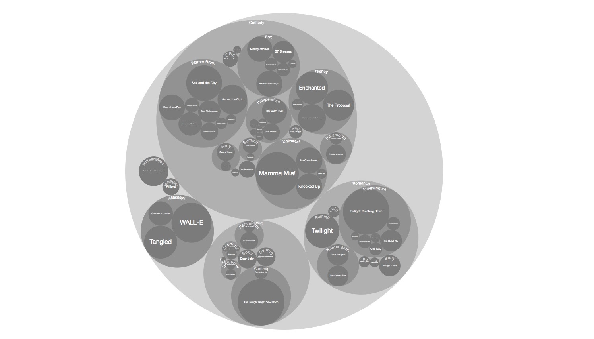

[原文链接](https://www.d3indepth.com/introduction/)

D3是一个用于定制可以在Web页面上可展示、可交互图表、地图的JS库。

尽管大多数图表库（如Chart.js、Highcharts）提供了现成的图表供开发者使用，但D3却是由大量的模块组成的，通过使用这些模块我们可以自定义构建图表和地图。

D3提供的方法相对其他图表库要更加底层，使用chart.js创建一个条形图可能只需要使用几行代码。

但是使用D3来实现相同图表你需要做的更多：

* 创建SVG的`rect`元素，并且将数据绑定在元素上。
* 将`rect`元素定位到指定位置
* 根据绑定数据来设置`rect`元素的尺寸
* 添加坐标轴

除了创建图表外，你可能还希望：

1. 当图表首次加载时有动效
2. 当图表容器大小有变化时，图表会跟着重新自适应。
3. 增加一个tooltip

当然，这些都是些额外的工作。但是它可以让你**完全**掌控图表的展示效果以及交互行为。

如果你仅仅只是需要一个柱状、折线、饼图的话，你可以考虑使用`Chart.js`，如果你希望创建一个完全由你全定制化的图表，建议你可以尝试使用D3。

D3有以下这些优点值得你来考虑：

1. HTML/SVG元素的更新完全由数据驱动
2. 支持加载和转换数据格式（类似CSV这类的数据）
3. 可以创建类似树图、捆图、网状图一类非常复杂的图表
4. 强大的渐变系统，可以用来做视图过渡动画效果。
5. 强大的交互支持，支持平移、缩放和拖动等交互。

#### 数据驱动更新HTML/SVG元素

先给出一个样例数据：

```js
[
  {
    "name": "Andy",
    "score": 37
  },
  {
    "name": "Beth",
    "score": 39
  },
  {
    "name": "Craig",
    "score": 31
  },
  {
    "name": "Diane",
    "score": 35
  },
  {
    "name": "Evelyn",
    "score": 38
  }
]
```

对于上面给出的数据，通过使用D3我们可以做到：

* 基于数组的长度增加/移除`div`元素
* 给每个`div`元素添加标题和柱子
* 根据数组元素中的`score`字段更新每个柱子的宽度。


#### 数据转换

D3提供了许多控制数据的方法，例如它有用于请求CSV数据的请求方法并且会将请求到的数据转换为数组对象。

比如现在有一个如下的CSV文件在你的服务器上：

```CSV
Film,Genre,Lead Studio,Audience score %,Worldwide Gross,Year
27 Dresses,Comedy,Fox,71,160.308654,2008
(500) Days of Summer,Comedy,Fox,81,60.72,2009
A Dangerous Method,Drama,Independent,89,8.972895,2011
A Serious Man,Drama,Universal,64,30.68,2009
Across the Universe,Romance,Independent,84,29.367143,2007
Beginners,Comedy,Independent,80,14.31,2011
```

可以使用`d3.csv`方法来请求文件：

```js
d3.csv('films.csv', function(err, data) {
  // 处理数据然后做展示
})
```

D3在上面的方法中会将CSV的数据转换为一个对象数组：

```js
[
  {
    "Film": "27 Dresses",
    "Genre": "Comedy",
    "Lead Studio": "Fox",
    "Audience score %": "71",
    "Worldwide Gross": "160.308654",
    "Year": "2008"
  },
  {
    "Film": "(500) Days of Summer",
    "Genre": "Comedy",
    "Lead Studio": "Fox",
    "Audience score %": "81",
    "Worldwide Gross": "60.72",
    "Year": "2009"
  },
  {
    "Film": "A Dangerous Method",
    "Genre": "Drama",
    "Lead Studio": "Independent",
    "Audience score %": "89",
    "Worldwide Gross": "8.972895",
    "Year": "2011"
  },
  {
    "Film": "A Serious Man",
    "Genre": "Drama",
    "Lead Studio": "Universal",
    "Audience score %": "64",
    "Worldwide Gross": "30.68",
    "Year": "2009"
  },
  {
    "Film": "Across the Universe",
    "Genre": "Romance",
    "Lead Studio": "Independent",
    "Audience score %": "84",
    "Worldwide Gross": "29.367143",
    "Year": "2007"
  },
  {
    "Film": "Beginners",
    "Genre": "Comedy",
    "Lead Studio": "Independent",
    "Audience score %": "80",
    "Worldwide Gross": "14.31",
    "Year": "2011"
  }
]
```

#### 图形

制作可交互的图表是D3最有名的能力了，这些图表主要是由SVG的`line`、`circle`、`path`和`text`元素组成的。

假设你有一组坐标数据：

```js
var data = [[0, 50], [100, 80], [200, 40], [300, 60], [400, 30]];
```

你可以使用D3基于这些点坐标连线制成折线图：


你可以再选择用曲线来插值这些点：


D3也可以创建坐标轴：


与其他的D3元素一样，有很多可用配置。例如你可以修改坐标轴方向、数值以及各式等样式。


#### 布局

D3提供了许多布局，这些布局将帮助数据转换为可视布局的函数。例如，如果我们有层次(或树状)数据，我们可以使用布局来创建树图:


圆形捆图(叶节点按收入大小调整):



矩形树状图：


在底层，布局方法向每个数据元素添加若干属性(例如位置、半径、宽度和高度)。然后可以在更新DOM元素时使用这些属性。

#### 过渡

D3很容易引入DOM状态之间的过渡效果。不仅位置和大小(如宽度、高度、半径)可以顺利过渡，颜色的渐变也可以做到如丝般顺滑:


除了制作令人赏心悦目的视觉效果外，过渡效果还可以帮助使用者跟踪元素在不同状态之间的变化。

#### 用户交互

D3有许多有用的小工具提高用户的交互，例如Voronoi网格（优化鼠标悬浮、点击、触控区域）、笔刷、缩放和拖拽等

如下例，假设我们有许多带有鼠标悬浮效果的点，因为点的尺寸过小，鼠标每次要悬浮在上面比较困难。


但是如果使用了D3的voronoi网格布局，将有助于确定离用户悬停/点击/触控最近的点，如上图前后对比的效果。