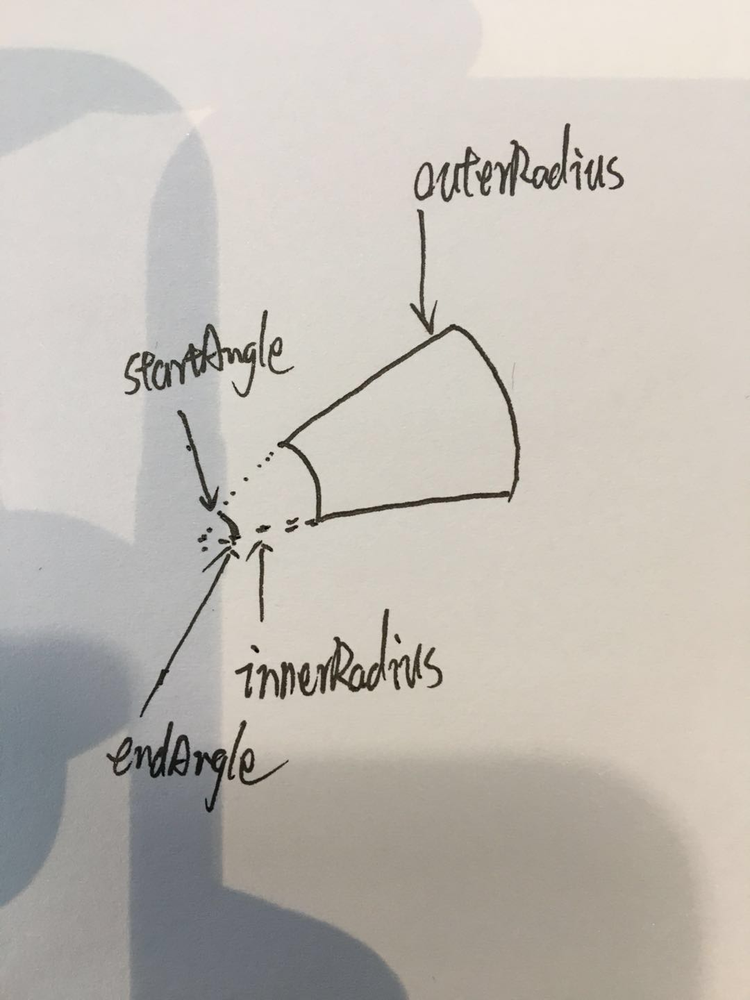
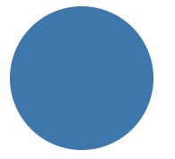
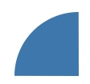
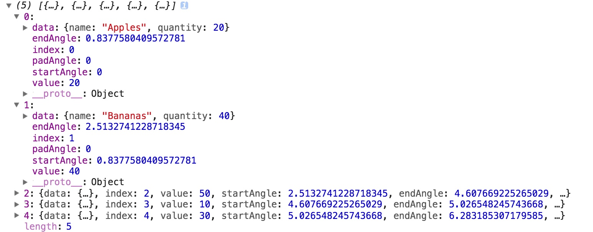
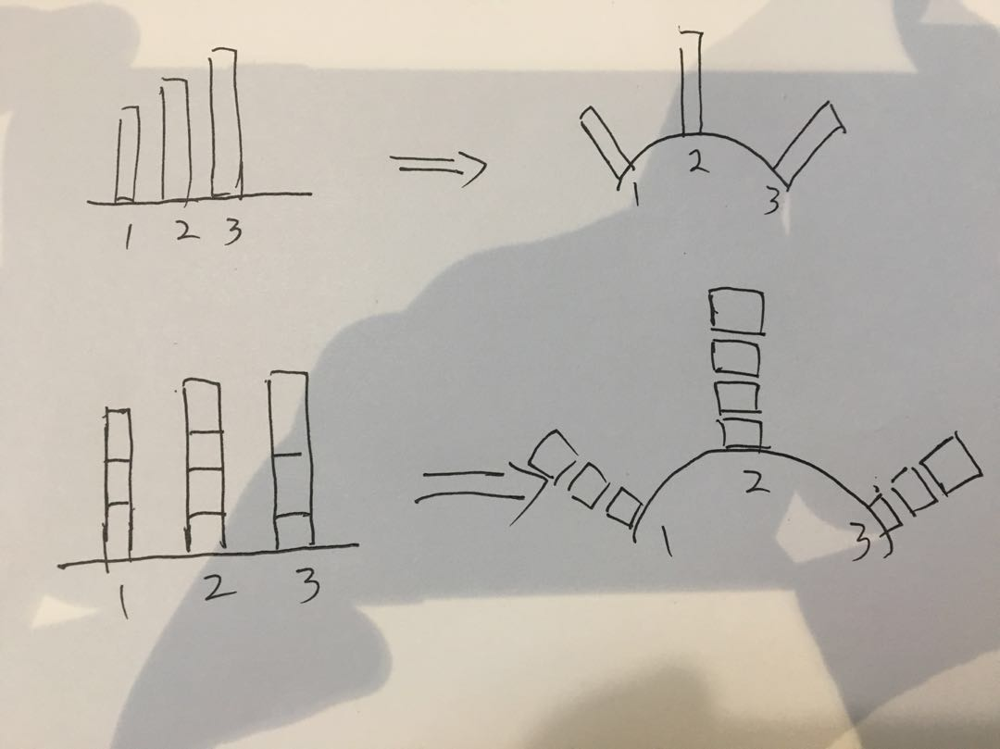
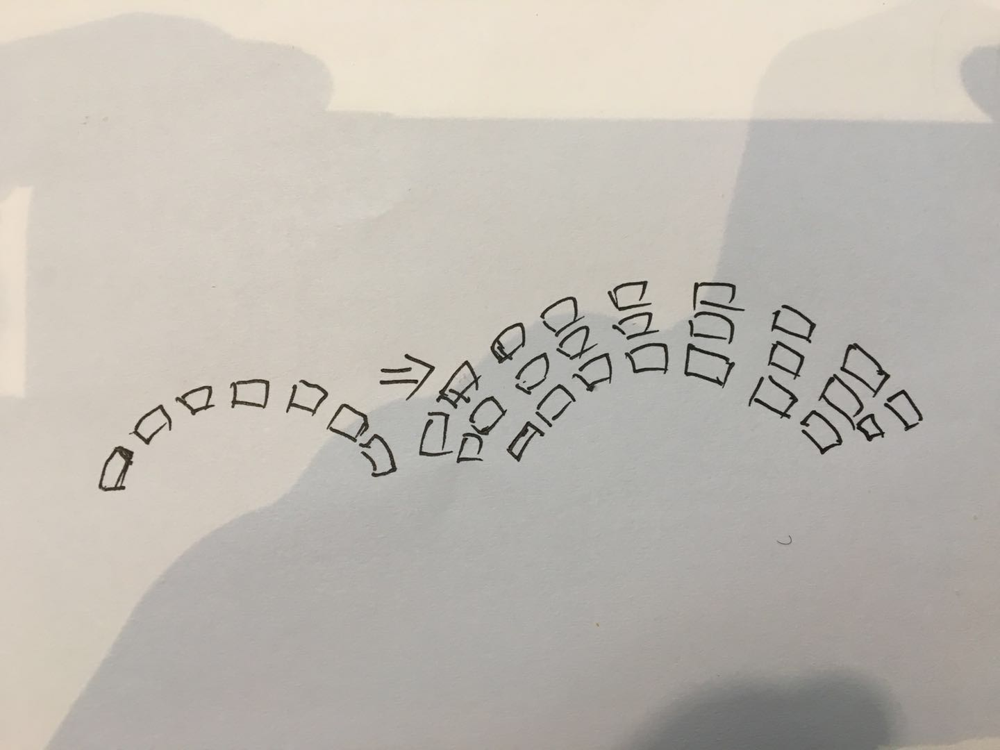
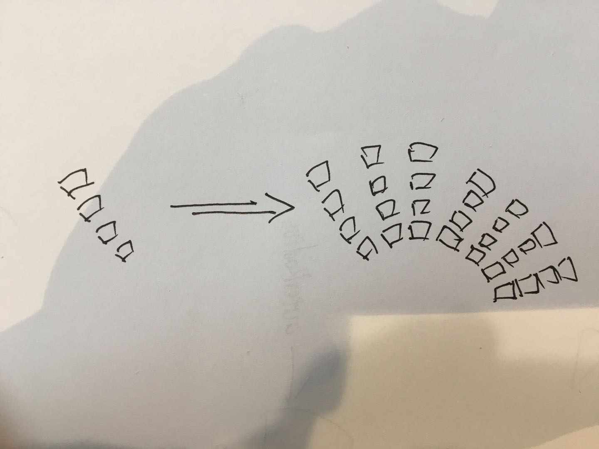
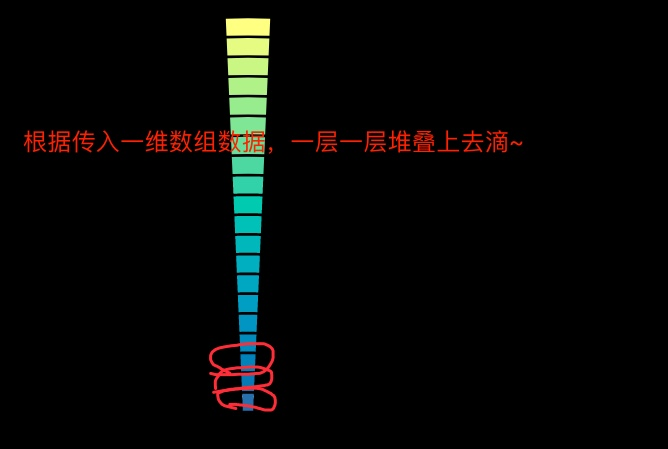
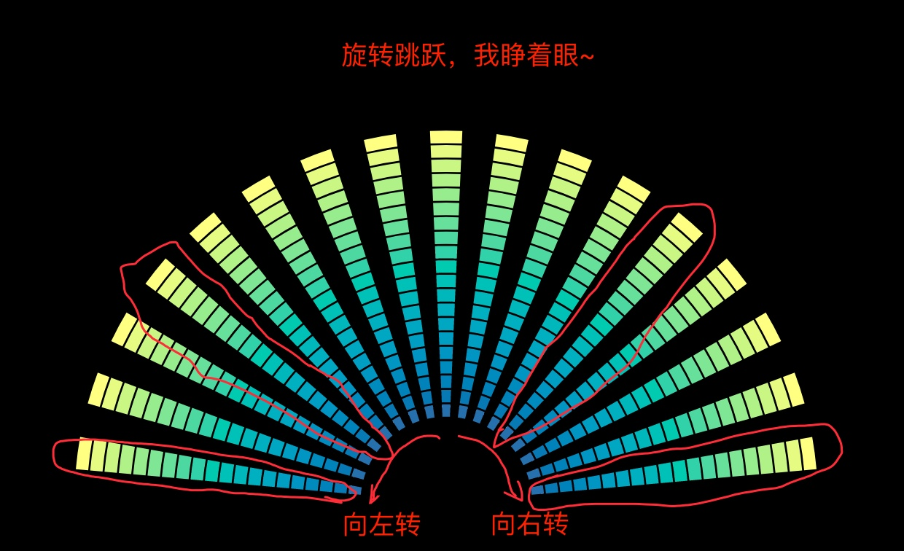

## 1. 画个圆

在画大屏之前，我们首先来画一个基础的饼图。不要小看它，须知，万事万物起始都是从一个圆开始的。

我们画圆需要用到的第一个方法就是`d3-shape`模块下面的`d3.arc`[方法](https://github.com/d3/d3-shape#arcs)。

`d3.arc(arguments..)`




<center>图1</center>


该方法会创建一个生成器（generator），依据你在如图1中传入的参数值。生成并返回`path元素`中`d`属性绘制圆形所需要的值。这个值中会包含圆的**起始**、**终止**角度(顺时针方向)；内外圆**半径**（用于决定你是画圆还是画圆环）。下面就让我们来生成该方法吧~ 


```js
const arc = d3.arc()
```

就像我上面说的那样，角度、半径等值是可以由我们来自定义设定哒~，所以我们先来画个圆，以下有两种方式来实现：

### 方法一：

直接传入绘制圆形的若干属性值：

```js
arc({
  startAngle: 0,
  endAngle: Math.PI * 2,
  innerRadius: 0,
  outerRadius: 180,
})

/* 返回值，嗯，暂时不需要理解它是什么意思，反正这就是个圆
M1.1021821192326179e-14,-180A180,180,0,1,1,-1.1021821192326179e-14,180A180,180,0,1,1,1.1021821192326179e-14,-180Z
*/
```

### 方法二：

可以通过`d3.arc`内置的函数使用链式方法依次设定这些属性值

```js
arc()
  .startAngle(0)
  .endAngle(Math.PI * 2)
  .innerRadius(0)
  .outerRadius(180)
```

### 举个🌰

```js
const arc = d3.arc()
  .startAngle(0)
  .endAngle(Math.PI * 2)
  .innerRadius(0)
  .outerRadius(180)

d3.select('svg')
  .append('path')
  .attr('d', arc)
  .style('fill', 'steelblue')
```



<center>图2 - 效果图</center>

## 2. 画个扇形

上面我们把圆形已经画出来了，设置项也有过简单了解。下面我们通过调整设置项来达成画弧形的**成就**，切记这是通往圆形异形图的必经之路，请睁好可爱的小眼睛！

圆形的起始、终点角度分别为`0`和`Math.PI * 2`，由此可以推导得我画个明媚而忧伤的四十五度角，也就是从`0`到`Math.PI / 4`这么一个距离。

```j
const quarterArc = d3.arc()
  .startAngle(Math.PI / -4)
  .endAngle(0)
  .innerRadius(0) // 不为0的话就是个环形弧了
  .outerRadius(180)
  
d3.select('svg')
  .append('path')
  .attr('d', quarterArc)
  .style('fill', 'steelblue')
```



<center>图3 - 效果图</center>

好了，此时四分之一圆已经出现了，想要换个方法定制化也可以通过以上几个属性任意定制了

```js
// 修改innerRadius和endAngle将上面的扇形变成一段圆弧
arc.innerRadius(60)
  .endAngle(Math.PI / -8)
```


<center>图4 - 效果图</center>


#### 插个播`d3.pie`

刚开始了解d3属性的小伙伴会来问： 如果`d3.arc`是用来画圆的方法，那`d3.pie`这个看起来更像用来做饼图的方法是TM什么玩意？？

**在此给你科普一下：**

> `d3`其实是将画图方法分为很多模块的，其中就有我们上文所说的`d3-shape`模块和包含`d3-layout`模块。


`d3-shape`模块如其名就是用来画各种形状的一个方法，这个模块下面封装的各种方法能够很轻易的帮你画出很多基础图形，比如`d3.arc`，`d3.area`， `d3.stack`，`d3.line`...

`d3-layout`模块是用来进行布局的，简单解释就是将你传入的格式数据进行再**格式化**，并赋予额外布局所需属性的一个牛逼方法。比如我们要说明的圆饼图，我们不可能只是用它来画个圆那面简单吧，肯定还想要用它来制作展示数据占比情况的**圆饼图**吧。

这个时候如果要求你来计算传入各数据的占比情况和在圆中所占角度是不是很蛋疼的一件事？

这个时候`d3.pie`的用途就提现出来了，它可以来帮我们把占比情况和各块的**起始、终止**角度都计算好，然后赋值给传入的数据中并返回。

多说无益，上代码：

```js
const pie = d3.pie()
  .startAngle(0)
  .endAngle(Math.PI * 2)
  .value(function(d) {return d.quantity;})
  .sort(function(a, b) {
    return a.name.localeCompare(b.name);
  });

const fruits = [
  {name: 'Apples', quantity: 20},
  {name: 'Bananas', quantity: 40},
  {name: 'Cherries', quantity: 50},
  {name: 'Damsons', quantity: 10},
  {name: 'Elderberries', quantity: 30},
];
```

返回数据格式：





<center> 图5 - 转换后数据</center>


看到了嘛！看到了吗？这个返回值会有`startAngle`和`endAngle`，有了这两个属性值，妈妈再也不用担心我画圆了（我就是不一样的小圆规 + 量角器），有了这些值想画什么饼图都可以轻松画出来了~

**总结：**

`d3.pie`可以理解为一个数据转换方法，可以将你传入的数值数据转换为几何属性数据，以此类推`d3-layout`中的其他方法也同样。

## 3. 画一层圆弧柱形



我们这个扇形图单层可以简单理解为一个柱形图，只是x轴从直线变成了个半圆弧。所以这个时候就需要将x轴的宽度从画布的长度换为角度值啦。

就是假设画布尺寸为500 x 500，我们原来设定x轴长度为500，绘制其实点为[0, 500]。NOW！我们则要设定变为`[-Math.PI * 0.5, Math.PI * 0.5]`，半径为250（没办法整圆直径为500）。

**方法一：**

```js
// 正常柱图原比例尺
const originScaleBand = d3.scaleBand()
  .domain(d3.range(0, 20))
  .range([0, 500])

// 现在圆柱图的比例尺
const radialScaleBand = d3.scaleBand()
  .domain(d3.range(0, 20))
  .range([-Math.PI * 0.5, Math.PI * 0.5])
```

通过以上比例尺我们可以将半个圆平分为20块了，为了能够分把这些柱子分的更清楚些，我们可以通过`.padding() || .paddingOuter() || .paddingInner()`等方法来设置各个柱子的间距（不推荐使用paddingOuter，因为会让这个半圆看起来差那么一点，具体原因自己看文档，宝宝懒得解释了。）

Emmmmmmm，其实后面也可以使用`d3.arc`的`.padAngle`方法来达到同样效果，在此不多说了，反正你试试就知道了。

**画图源码**


```js
const data = d3.range(0, 20)
const bows = d3.select('svg')
  .attr('transform', 'translate(250, 500)')
  .selectAll('.raidial-bar-block-item')
  .data(data)
  .enter().append('g')
  .attr('class', 'raidial-bar-block-item')
  
  bows.append('path')
    .attr('d', d3.arc()
      .startAngle(d => radialScaleBand(d))
      .endAngle(d => radialScaleBand(d) + radialScaleBand.bandwidth())
      .padAngle(0.02) // 假如你木有设置.padding时，可以使用，否则有点重复了
      .innerRadius(100)
      .outerRadius(130)
    )
    .style('fill', '#ccc')
  
```

**方法二：**

```js
const data = d3.range(0, 20)
const bows = d3.select('svg')
  .attr('transform', 'translate(250, 500)')
  .selectAll('.raidial-bar-block-item')
  .data(data)
  .enter().append('g')
  .attr('class', 'raidial-bar-block-item')
  .attr('transform', d => `roatate(${radialScaleBand(d) + radialScaleBand.bandwidth() / 2})`)
  
bows.append('path')
  .attr('d', d3.arc()
    .startAngle(Math.PI / -40)
    .endAngle(Math.PI / 40)
    .padAngle(0.02) // 同上
    .innerRadius(100)
    .outerRadius(130)
  )
  .style('fill', '#ccc')
```

## 4. 画多层圆弧



既然现在我们能画单层的圆柱图了，那还有什么我们做不到的呢！多层柱图也无非就是设置不同`innerRadius`和`outerRadius`不同而已了。这个时候绑定在svg元素上的data也就是变成一个二维数组。

第二维的数组依据顺序递增，内外圆半径逐渐递增。

```js
const data = d3.range(0, 20)
  .map((d, i) => {
    const data = d3.range(0, 25).map((d, j) => ({
      value: d,
      base: i
      index: j,
    }))
    return {
      i,
      data,
    }
  })
  
const bowConatainers = d3.select('svg')
  .attr('transform', 'translate(250, 500)')
  .selectAll('.radial-bar-contatiner')
  .data(data)
  .enter().append('g')
  .attr('class', 'radial-bar-contatiner')
  
const bows = bowConatainers.selectAll('radial-bar-block-item')
  .data(d => d.data)
  .enter().append('g')
  .attr('class', 'radial-bar-block-item')
  .append('path')
  .attr('d', d3.arc()
    .startAngle(radialScaleBand(d.base))
    .endAngle(radialScaleBand(d.base) + radialScaleBand().bandwidth())
    .innerRadius(d => (20 + d.index * 15 - 10))
    .outerRadius(d => (20 + d.index * 15))
  )
  .style('fill', '#ccc')
  
```

### 控制色块高度

因为要依据数据等比例展示色块高度，所以在此时我们要使用比例尺来转换各色块的高度。

上面的代码可以知道各色块的高度为`15px`，我们需要按照数据来定义比例尺，设定此时各色块表示最大数据为10，最小为0：

```js
const scale = d3.scaleLinear()
  .domain([0, 10])
  .range([0, 15])
```


### 升级加颜色

通过插值器和比例尺分区间加颜色，由于插值器要求传入值为[0, 1]这个区间内的值。因此需要通过线性比例尺将[0, 24]等比例转换为[0, 1]区间内的值，然后再使用插值器转换为对应的颜色。

```js
const a = d3.rgb(159, 249, 223)
const b = d3.rgb(85, 229, 208)
const c = d3.rgb(0, 169, 180)
const d = d3.rgb(0, 81, 165)
const e = d3.rgb(95, 31, 167)

const colors = d3.interpolateRgbBasis([a, b, c, d, e])

const linear = d3.scaleLinear()
  .domain(d3.range(0, 25))
  .range([0, 1])
  
bows.style('fill', d => colors(linear(d.index)))
```

## 另一种思路来画扇形堆叠图



上面那种方式是不是让你觉得烦？一大坨代码都写在同一个文件中，代码拆分起来也不清晰~

那么我们下面就换另一个思路来画这个大屏圆：

在上面我讲到了`d3-shape`和`d3-layout`分别是用来绘制图形和布局的两个模块，那我们是不是可以模仿这一思路，声明两个分别用来绘制堆叠柱和将这个柱子进行布局的方法呢？

### 单根柱子

使用`d3.arc`方法我们可以用来画圆、画圆环还可以画一段圆弧。因此我们可以用上面画多层圆环的思路，来画单根弧堆叠组成的柱子。

**效果图**



```js
function radialBar(svg) {
  const arc = d3.arc()
  .startAngle(Math.PI / -70)
  .endAngle(Math.PI / 70)
  
const innerRadius = 150
const padding = 15
const height = 20
const data = d3.range(0, 20)

svg.append('g')
  .selectAll('.radial-bar')
  .data(data)
  .enter().append('path')
  .attr('class', 'radial-bar')
  .attr('d', arc
    .innerRadius((d, i) => (innerRadius + height * (i + 1) - padding))
    .outerRadius((d, i) => (innerRadius + height * (i + 1)))
  )
  .attr('fill', '#fff')
}
```

好！依照上面的代码我们就（大概）能得到一个上图效果图风格样式的柱子了。

既然已经有这样一个能直接生成单根柱子的方法了，那后面出一个半圆的形状，也就是`Control + C` 和`Conttrol + V`的工作了呗。

### 布局

上面的方法可以很好的完成画图形的任务了，下面的工作也很明确了：布局方法按照一定规律旋转角度，以达成拼成一个半圆的成就。 

可以使用`d3.scaleBand`方法将`[-Math.PI * 0.5, Math.PI * 0.5]`等分为若干块。然后将柱子依次旋转：

**效果图**




**动图**


```js
const scaleBand = d3.scaleBand()
  .domain(d3.range(0, 35))
  .range([-Math.PI * 0.5, Math.PI * 0.5])
  .paddingInner(0.03)
  
svg.append('g')
  .attr('transform', 'translate(1000, 900)')
  .selectAll('g.bar-container')
  .data(d3.range(0, 35))
  .enter().append('g')
  .attr('class', 'bar-container')
  .attr('transform', (d, i) => `rotate(${(scaleBand(i) + scaleBand.bandwidth() / 2) * 180 / Math.PI})`)
  .each(function() {
    radialBar(d3.select(this))
  })
```


[代码链接](https://codepen.io/Narcissus_Liu/full/XzyZMM)

拓展：
- 渐变色： 使用`<radialGradient>`的`gradientUnits="userSpaceOnUse"`属性来做大屏的渐变效果。[相关链接](http://www.oxxostudio.tw/articles/201409/svg-25-gradients-patterns.html)

- 比例尺： 各个小色块依据数值多少等比例显示