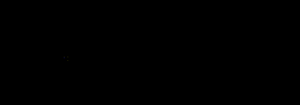

没有飞线的地图就像一个发际线上移的中年人一样平淡无奇。

<p style="text-align: right;">—— By 胖子</p>

每年春运和双十一的统计图都因为有飞线动效才更加吸引眼球，今天我要为大家分享下绘制一个漂亮飞线的各种姿势。

## SVG

强大的SVG必定能完成我们绘制飞线效果的各种需求，首先我先为各位介绍下完成这根线需要知道的基础知识。

**Path元素**

[path元素](https://developer.mozilla.org/zh-CN/docs/Web/SVG/Tutorial/Paths)是SVG基本形状中最强大的一个，它不仅能创建其他基本形状，还能创建更多其他形状。这里我们只需要用它来绘制一条曲线。

首先我们先创建好这根曲(tou)线(fa)。

```HTML
<svg>
  <path
    fill="none"
    stroke="#FFFFFF"
    d="M50, 50 C70, 200 200, 200  800, 80"
    id="line"
  ></path>
</svg>
```


OK，这根头发我们已经在屏幕上放好了，如果你将path元素的曲线无限放大会发现，其实它是由非常多的坐标点相互连接组成的。这个时候脑洞放一下，如果我们能获取到这些点是不是就是获取了线的绘制轨迹。就可以逐帧绘制飞线了动效了。


如何获取和使用这些坐标点？
勤奋的查阅MDN，我发现这个问题强大的SVG已经帮我们解决了，可以使用`getTotalLength`和`getPointAtLength`这两个方法来搞定。

#### [`SVGPathElement.getTotalLength`](https://developer.mozilla.org/en-US/docs/Web/API/SVGPathElement/getTotalLength)

但因为SVG中绘制的都是矢量图，所以path元素不存在是由若干个点构成的，所以调用该方法会返回该path元素从起始点到终点的总长度（浮点数）。

尽管和预期有所差别，但搭配上下面的`getPointAtLength`方法我们依然能完成之前预想的实现方法。

#### [`SVGPathElement.getPointAtLength`](https://developer.mozilla.org/en-US/docs/Web/API/SVGGeometryElement/getPointAtLength)

调用该方法会根据传入到起点的距离值来计算返回对应的path元素坐标点的位置x、y值。

通过组合使用这两方法，我们可以自己定义这段轨迹上有有多少个坐标点，并且可以获取对应这些点的坐标值。

下面我们使用D3来操作这些DOM节点获取对应的节点数据信息

首先我们需要先定义好飞线轨迹是由多少个点构成的：

`const pointNum = 1500`

接下来我们可以通过方法将获取到的轨迹总长度进行平分得到单位长度`unit`，然后再调用`getPointAtLength`获取对应距离的坐标值。

```js
const pointNum = 1500
const path = d3.select('#line')
const pathline = path.node()
const totalLength = pathline.getTotalLength()
const points = []

const unit = totalLength / pointNum

for (let i = 0; i <= pointNum; i += 1) {
  points.push(pathline.getPointAtLength(i * unit))
}
```

接下来我们就可以通过这些数据绘制飞线动效了。

#### 飞线动效-1

如下图，其实实现飞线具体头部深、尾部浅效果可以通过绘制若干透明度逐渐递减的圆来达到。（Echarts飞线使用类似思路）


接下来所需要做的就是让上面的飞线像下图的矩形一样，让它按照对应的轨迹路线来进行移动。


但由于飞线是由若干个圆重叠组成的，所以不能像矩形一样只需要控制一个元素的`x`、`y`值就搞定运动行为。尤其是如下图这样的曲线运动的情况。


为此我们需要声明一个飞线类，首先需要定义飞线的长度、样式速度等特性。

由于之前已经声明好该路径轨迹拆分成多少段了，所以在此我们取个巧定义飞线的长度是其中`lineLen`段的长度，设定速度为每次渲染移动`speed`段。

```js
class FlyLine {
  totalNum = 1500
  lineLen = 150
  speed = 15
  radius = 2.5
  fill = 'rgb(255, 200, 65)'
  circles = []
  constructor(){
    // percent的用处会在后面体现
    this.percent = this.lineLen
  }
}
```


> 上面的说明看不懂？灵魂画手图片解析

定义好飞线的特性变量之后，接下来我们可以绘制具体的飞线了。

因为飞线是若干`circle`元素堆叠成的，所以我们在此提炼出一个公有的画圆方法：

```js
class FlyLine {
  ...
  ...
  _drawCircle(cx, cy, i) {
    const {radius, circles, fill} = this
    if (circles[i]) {
      circles[i].attr("cx", cx).attr("cy", cy)
    } else {
      circles.push(
        circleG1
          .append("circle")
          .attr("cx", cx)
          .attr("cy", cy)
          .attr("r", radius)
          .attr("fill", fill)
          .attr('fill-opacity', i * 0.001)
      )
    }
  }
}
```

根据传入位置、索引值创建或更新`circle`元素的位置和元素的透明度。

现在我们来绘制第一个静态的飞线：

首先需要确定绘制飞线是由多少段小线段组成的（实际是由多少个圆相临近堆叠成的），接着我们就可以按照由浅及深的顺序开搞了。

```js
class FlyLine {
  ...
  ...
  _drawFlyLine(){
    const {points, percent, lineLen} = this
    for (let i = percent - lineLen, j = 0; i < percent; i += 1, j += 1) {
      this._drawCircle(points[i].x, points[i].y, j)
    }
  }
 }
```



<center>实例展示飞线绘制过程</center>

现在我们拿到这条飞线了，要如何让它按照预定的轨迹运动是我们下一步要解决的问题了。

换一个思路来想，我们是不是可以把这根生成的飞线看做成上面的一个`rect`元素？两者唯一不同的点就是`rect`元素只需要更新自己的`x`、`y`属性就好，而要移动飞线需要同时更新这些`circle`元素的`cx`和`cy`属性。

因为我们已经知道了飞线的具体移动轨迹了，所以这时候我们更新飞线中各个`circle`元素对我们来说不是一件很复杂的事情。

> 这下之前定义的percent就派上用场了

```js
class FlyLine {
  ...
  ...
  animate() {
    const {lineLen, speed, totalNum} = this
    this._drawFlyLine()
    this.percent = this.percent + speed > totalNum ? len : this.percent + speed
    requestAnimationFrame(() => this.animate())
  }
}
```

此时的`percent`就如同`for`循环中常用的`i`变量一样，逐渐自增`speed`，当到头就归零重新往复。

现在整个飞线动效的逻辑都清晰了：

`FlyLine.animate`方法本质上就是个复读机，一遍一遍的让`percent`变量由小到大变化，控制飞线由起始点到轨迹终点移动。


`FlyLine._drawFlyLine`方法的作用就是根据`percent`变量的值创建or更新飞线位置。

`FlyLine._drawCircle`就更不用说了，苦逼小弟，创建or更新`circle`元素的属性。`percent`变量更新一次，它要被苦逼的调用`lineLen`次。


**现在这根飞线终于好好的动起来啦，真TM不容易。为了讲明白废了我不少（无用的）脑细胞。**

当然，这个方法还不够完美，有许多需要优化的点，例如：

1. 飞线的长度不能超过我们对轨迹分割的段数。
2. 画一根飞线就要生成/更新几百个`circle`元素，浪费浏览器性能。

抛砖引玉，希望能够给大家提供一个好的思路来制作出更酷炫的飞线动效来。

#### 飞线动效-2

算了，等不及你们来引玉了。我自己再继续开搞吧。

在上面提到的绘制一个飞线要上百个`circle`元素，这样非常浪费浏览器性能。

有没有好点的办法解决这个优秀前端不能忍受的痛呢？有！还真有！！

下面让我们开搞！！

我们知道NB的`path`元素可以绘制任意图形，上文中的飞线轨迹也是这样得到的。

这个时候我就在想了，D3相当NB了。它的过渡(`transition`)效果也是相当可以的。为什么我们不能直接拿来绘制飞线动效呢？

首先我们知道D3拥有`attrTween`这个属性过渡方法，我们可以在其中返回插值函数，根据传入的进度值不断变化元素的属性，呈现过渡动画效果。

现在先让我们用`path`画一根直线：

```js
const path = container
  .append('path')
  .attr('fill', 'none')
  .attr('stroke', 'none')
  .attr('d', 'M50, 50  600, 50')
  .attr('id', 'line')
  
const pathline = path.node()
const len = pathline.getTotalLength()

const animate = () => {
  container.select('#flyline').remove()
  container.append('path')
  .attr('stroke', '#19D0DC')
  .attr('fill', 'none')
  .attr('id', 'flyline')
  .attr('stroke-width', '3px')
  .transition()
  .duration(5000)
  .attrTween('d', function(d) {
    const coord = path.attr('d').replace(/(M|Q)/g, '').match(/((\d|\.)+)/g)
    var x1 = +coord[0], y1 = +coord[1] // 起点
    return function(t) {
      const p = pathline.getPointAtLength(t * len)
      return `M${x1}, ${y1} ${p.x}, ${p.y}`
    }
  })
}

setInterval(animate, 5200)
```

已知直线路径长度和起点，并且这根线也不会拐弯，所以直接根据插值函数传入的进度值，通过使用`getPointAtLength`方法得到对应时刻的坐标值更新`path`元素的"d"属性即可。


直的搞定了，现在就是考验我们的时候了。我们需要使用熟练的技巧将耿直的它给**掰弯**了。

下图是一根二次贝塞尔曲线的绘制过程。因为轨迹已知，所以在各个阶段的起始点都是可以通过`getPointAtLength`方法获得的。唯一需要计算的只有不同阶段贝塞尔曲线控制点的位置。可以看到绘制它的过程中需要持续更新控制点，为此我去查了下二次贝塞尔曲线控制点的计算公式。


根据以上的推导式我们确定了控制点的计算方法：

```js
.attrTween('d', function(d) {
    const coord = path.attr('d').replace(/(M|Q)/g, '').match(/((\d|\.)+)/g)
    var x1 = +coord[0], y1 = +coord[1], // 起点
        x2 = +coord[2], y2 = +coord[3], // 控制点
        x3 = +coord[4], y3 = +coord[5]; // 终点
    return function(t) {
      const p = pathline.getPointAtLength(t * len)  
	   // 根据插值方法进度实时计算当前控制点位置
      const x = (1 - t) * x1 + t * x2
      const y = (1 - t) * y1 + t * y2
      return `M${x1}, ${y1} Q${x},${y} ${p.x}, ${p.y}`
    }
  })
```

**path元素的渐变效果如下**


这根线终于能做到从头飞到尾了，但是尾巴有点长。这可急坏老父亲了：长残了将来可怎么找对象啊！？

别急，毕竟他是生在长在我大中国的一根线。**线丑不怕，美颜来凑啊！**

我们现在来帮它磨磨皮：

SVG为我们提供了蒙板遮罩等功能，我们只需要在蒙板中定义了一个透明度从内到外逐渐降低径向渐变的圆。然后让他一直跟着飞线的头移动就好了。

```html
<svg>
    <defs>
    <mask id="Mask">
          <circle id="m-circle" r="150" fill="url(#grad)"  />
    </mask>
      <radialGradient
        id="grad"
        cx="0.5"
        cy="0.5"
        r="0.5" >
        <stop offset="0%" stop-color="#fff" stop-opacity='1'/>
        <stop offset="100%" stop-color="#fff" stop-opacity='0' />
    </radialGradient>
</defs>
</svg>
```

```js
const mCircle = d3.select('#m-circle')
.attrTween(function(d){
  ...
  const x = (1 - t) * x1 + t * x2
  const y = (1 - t) * y1 + t * y2
  mCircle.attr('cx', x)
    .attr('cy', y)
})
```

**美颜后的效果：**


怎么样，是不是可以勉强拿去相亲了！


#### 飞线动效-2优化

优化方案: 

使用`createElementNS`在内存中创建path元素，这样就减少了渲染的成本，然后可以再提取`d`属性值

## 卡住了，想不出好的解决办法

使用**polyline**元素优化

已知起始和结束点，已经控制点的计算公式。然后计算出所有点的轨迹路径

## Canvas


## 小飞机

## 性能优化

