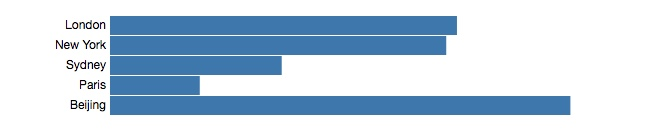
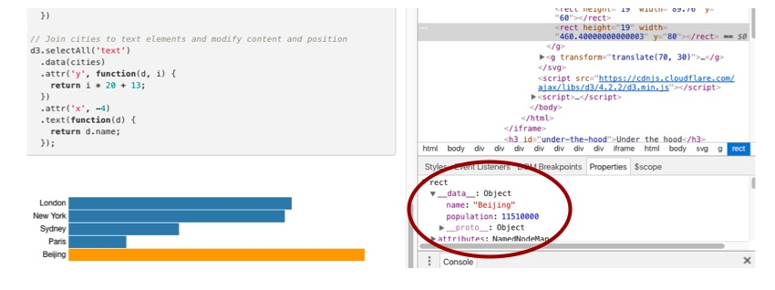

参考阅读文章：

> [Thinking with Joins](https://bost.ocks.org/mike/join/)
  [D3 Selection Join Data](https://github.com/d3/d3-selection#selection_data)

### 元素绑定数据

当我们使用`d3.selectAll('g')`得到一组D3选择集（D3 selection）时。我们可以给选择集合的每个元素绑定对应数据数组中的数据。这样做会让数据和图形元素之间的联系更紧密，似的数据驱动修改、更新元素更加简单明了。

**例子**

一组`circle`元素

```html
<circle r="40" />
<circle r="40" cx="120" />
<circle r="40" cx="240" />
<circle r="40" cx="360" />
<circle r="40" cx="480" />
```

和一组数据元素

```js
const scores = [
  {
    "name": "Andy",
    "score": 25
  },
  {
    "name": "Beth",
    "score": 39
  },
  {
    "name": "Craig",
    "score": 42
  },
  {
    "name": "Diane",
    "score": 35
  },
  {
    "name": "Evelyn",
    "score": 48
  }
]
```

接下来我们可以使用`.selectAll()`方法获取所有`circle`元素集合数组,并使用`.data()`方法将数据与之各个`circle`元素绑定。

```js
d3.selectAll('circle')
  .data(scores)
```

绑定之后我们就可以通过获取各元素绑定的数据直接操作或赋值元素的属性了：

```js
d3.selectAll('circle')
  .attr('r', d => d.score)
```

如下图为使用数组数据中各元素的`score`值来赋值`circle`元素的半径`r`属性。


**🌰代码**

```html
<svg>
  <circle r="40" />
  <circle r="40" cx="120" />
  <circle r="40" cx="240" />
  <circle r="40" cx="360" />
  <circle r="40" cx="480" />
</svg>

```


```js
const scores = [
  {
    "name": "Andy",
    "score": 25
  },
  {
    "name": "Beth",
    "score": 39
  },
  {
    "name": "Craig",
    "score": 42
  },
  {
    "name": "Diane",
    "score": 35
  },
  {
    "name": "Evelyn",
    "score": 48
  }
]
d3.selectAll('circle')
  .data(scores)
  .enter().append('circle')
  .attr('cx', (d, i) => i * 120 )
  .attr('r', d => d.score)
```

### 数据绑定元素

首先我们需要有一个数组和一个元素选择集，接下来使用`.data()`方法创建两数据、元素集合之间的联系。

```js
const myData = [ 10, 40, 20, 30 ];

const s = d3.selectAll('circle');

s.data(myData);
```

不只是纯数值数组，数组元素也可以是其他类型，例如使用最多的：`Object`元素。

```js
const cities = [
  { name: 'London', population: 8674000},
  { name: 'New York', population: 8406000},
  { name: 'Sydney', population: 4293000}
];
const s = d3.selectAll('circle');
s.data(cities);
```

你或许没有注意到，当`.data()`方法被调用进行数据绑定后d3会帮你做一些其他的事情。

这些**小事情**会在你基于数据更新元素状态时，咻咻咻的展现出来。D3真心太牛逼了！

### 数据驱动更新元素

当我们使用`.data()`方法将数据和元素绑定之后，我们就可以通过传入函数给`.style`和`.attr`等方法中修改元素的各个属性。

```js
d3.selectAll('circle')
  .attr('r', d => d)
```

D3选择集中的每个元素都会调用这个函数，传入函数的首个参数`d`默认为绑定到元素上的数据元素，该函数方法要求有返回值：用来设定元素的样式或属性。

例如：

**元素**

```html
<circle />
<circle />
<circle />
<circle />
<circle />
```

**数据**

```js
const myData = [ 10, 40, 20, 30, 50 ];
```

下面我们开始进行数据绑定：

```js
const s = d3.selectAll('circle')

s.data(myData)
```

现在我们使用绑定数据的值来更新圆半径：

```js
s.attr('r', function(d) {
  return d;
});
```

传入给`.attr`的函数总共被调用了五次（选择集中的每个元素都会调用一次），然后每个`circle`元素的半径`r`属性依次被赋值为10、40、20、30、50。

我们也可以对返回数据进行处理再返回：

```js
s.attr('r', function(d) {
  return 2 * d;
});
```

也能做条件判断：

```js
s.classed('high', function(d) {
  return d >= 0; // returns true or false
})
```

最后可以基于传入的第二个参数index来定位`circle`元素的位置：

```js
s.attr('cx', function(d, i) {
  return i * 120;
});
```
全部代码：

```js

var myData = [ 10, 40, 20, 30, 50 ];

var s = d3.selectAll('circle');

// Do the data join
s.data(myData);

// Modify the selected elements
s.attr('r', function(d) {
  return d;
  })
  .classed('high', function(d) {
    return d >= 40;
  })
  .attr('cx', function(d, i) {
    return i * 120;
  })
```


#### 对象数组

如果有一个由Object对象组成的数组，我们可以通过以下方式将其绑定：

```js
const cities = [
  { name: 'London', population: 8674000},
  { name: 'New York', population: 8406000},
  { name: 'Sydney', population: 4293000},
  { name: 'Paris', population: 2244000},
  { name: 'Beijing', population: 11510000}
];

const s = d3.selectAll('circle');

s.data(cities);
```

现在我们基于绑定数据`d`来更新元素，`d`此时表示绑定在元素上的Object数据。因此选择集首个元素绑定的数据`d`是`{ name: 'London', population: 8674000}`。

通过绑定数据，设定圆半径：

```js
s.attr('r', function(d) {
    const scaleFactor = 0.000005;
    return d.population * scaleFactor;
  })
  .attr('cx', function(d, i) {
    return i * 120;
  });
```

**效果图**


当然我们不仅仅局限于修改`circle`元素，如果我们有`rect`、`text`类型的元素，我们也可以构建一个简单的柱状图。

```js
const cities = [
  { name: 'London', population: 8674000},
  { name: 'New York', population: 8406000},
  { name: 'Sydney', population: 4293000},
  { name: 'Paris', population: 2244000},
  { name: 'Beijing', population: 11510000}
];

// 绑定数据到rect元素上
d3.selectAll('rect')
  .data(cities)
  .attr('height', 19)
  .attr('width', function(d) {
    const scaleFactor = 0.00004;
    return d.population * scaleFactor;
  })
  .attr('y', function(d, i) {
    return i * 20;
  })

// 绑定数据给text元素
d3.selectAll('text')
  .data(cities)
  .attr('y', function(d, i) {
    return i * 20 + 13;
  })
  .attr('x', -4)
  .text(function(d) {
    return d.name;
  });
```

**效果图**



### `.data()`具体机制

当D3执行`.data()`方法绑定数据时，它会在对应元素上添加一个`__data__`属性，让后将具体数据作为属性值赋值在上面。

通过Chrome浏览器的开发者工具我们可以查看到该属性内容。



### `.datum()`是做啥的？

在网上有很多例子是将单个数据与一个选择集绑定在一起（可以理解为就是只绑定在根节点上）。

```js
const featureCollection = {type: 'FeatureCollection', features: features};
```

这个时候我们就可以使用`.datum`方法来进行这样的操作。

```js
d3.select('#root')
  .datum(featureCollection);
```

**看清楚上面代码！只有通过查找id而进行单个节点选择。** 不是`.selectAll`方法。

`.datum`方法添加`__data__`属性到选择的元素上，并将`featureCollection`数据绑定到`#root`元素上。

**请记得，大部分时候我们只需要使用`.data`方法来绑定数据，`.datum`方法只有在一些特殊例子中才会使用。**